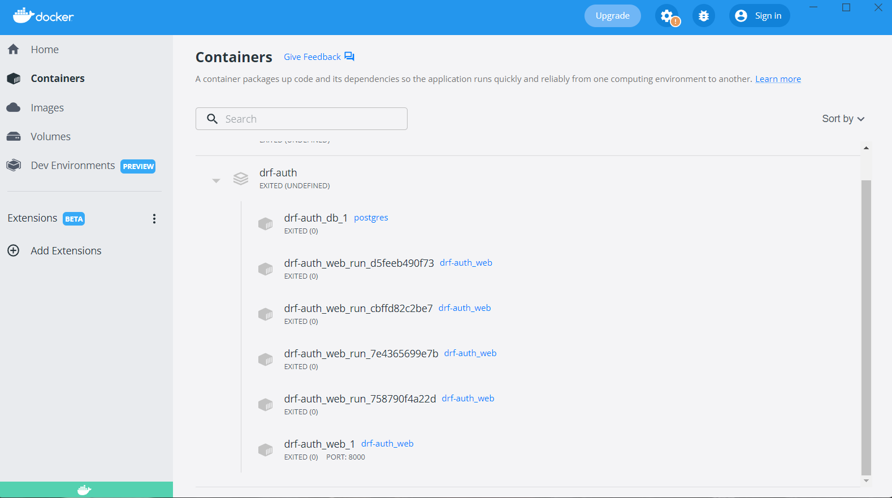

# LAB - drf-auth
#### username : admin
#### password : 12345

#### path url : http://localhost:8000/api/v1/car/
## Project: drf-auth
### Author: Abdulrahman Mansour
#### Links and Resources
- back-end server url N\A
- front-end application N\A
#### Setup
.env requirements ```.venv```
- PORT - 8000
- DATABASE_URL - N\A
#### How to initialize/run your application
```python manage.py runserver```
#### How to use your library 
```pip install -r requirements.txt```
##### Tests
- How do you run tests? ```python manage.py test```
- Any tests of note? N\A
- Describe any tests that you did not complete, skipped, etc N\A
#### Docker

